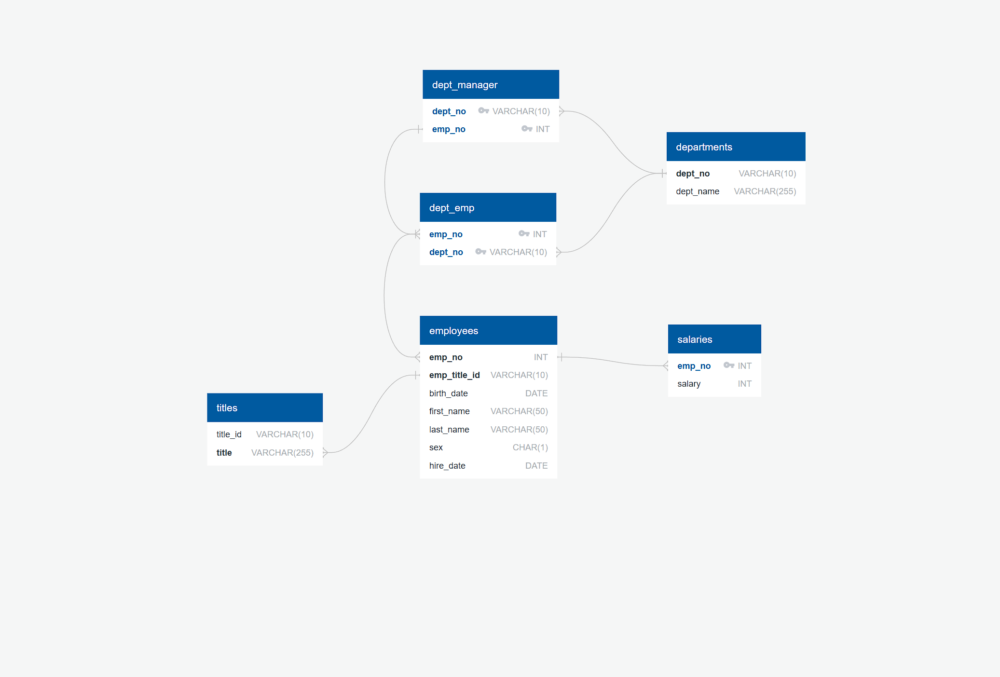
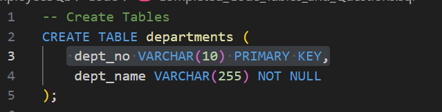

# Module 9- SQL challenge

## Overview

This project involves setting up and querying a PostgreSQL database utilizing pgAdmin. Tasks include importing CSV data, designing tables and executing SQL queries to retrieve insights related to employee and employer data. 

## Database Schema

### The database consists of the following tables:

1. **departments** - Stores department details
2. **employees** - Stores employee personal details
3. **dept_emp** - Tracks department assignments for employees
4. **dept_manager** - Stores department manager information
5. **salaries** - Tracks employee salaries
6. **titles** - Stores job titles

## Creating Tables

Prior to importing the CSVs to run queries, tables must be created to provide a "landing spot" for the CSV files. This was accomplished by using the CREATE TABLE function followed by the name of the CSV file (department, titles, etc.), then creating column headers and specifying the data type (VARCHAR, INT) and finally setting either PRIMARY KEY (ensures that  no 2 rows can have the same value) or NOT NULL (ensuring that a column cannot have NULL values in the table). 

### Example of  Table creation 

1.  **departments** 

   

2. **titles** 

   ​	
    
    

3. **employees** 

   ​	
    

## Importing data

After the tables have been created in the database, you can now import the CSV files. This step must be taken to be able to run queries on the data. 

		

After the tables have been created, the ability to import the CSV can be achieved by right clicking on the corresponding table for which CSV is to be imported, and selecting the import/export option. and follow the prompts within the sub menu.

## Queries and Outputs 

1. **employee information** - defines specific employee information (employee number, first and last name, sex and salary)

​   

   	

2. **Employees hired in 1986** - lists only employees hired in 1986

 
   	

  
  	

3. **Listing of Department Manager**-  lists the manager of each department with their employee information, along with department information

   ​

   	

   

   

   **Option to Export Quires to CSV Files** - to export the query results to CSV file, run the following input, and note it will need to be changed for each query: 

   

## Summary

This project covers the process of creating and managing a PostgreSQL database for employee and employer data analysis. It walks through table creation, data import, and querying techniques using pgAdmin. Key insights include employee information retrieval, department manager tracking, and salary analysis. The ability to export query results to CSV further enhances data usability. This structured approach provides a strong foundation for database management and SQL query execution.
## Conclusion

This project demonstrates how to set up, query, and analyze employee-related data using PostgreSQL and pgAdmin. The structured database schema, efficient queries, and CSV imports allow for a smooth data analysis workflow.

   

